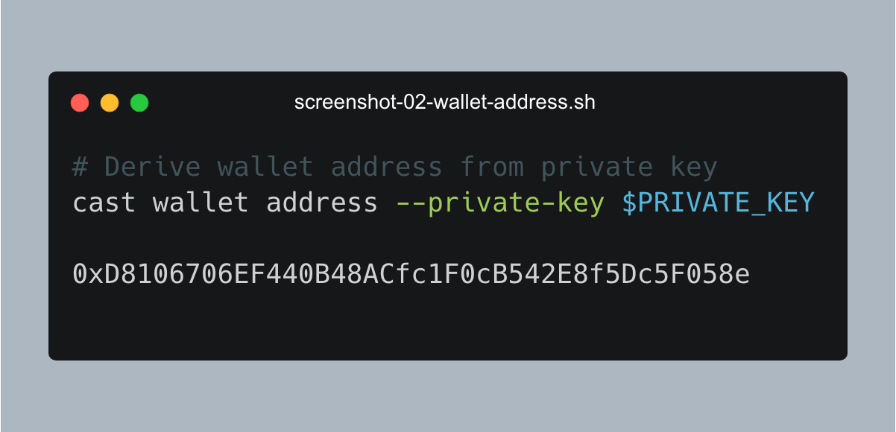
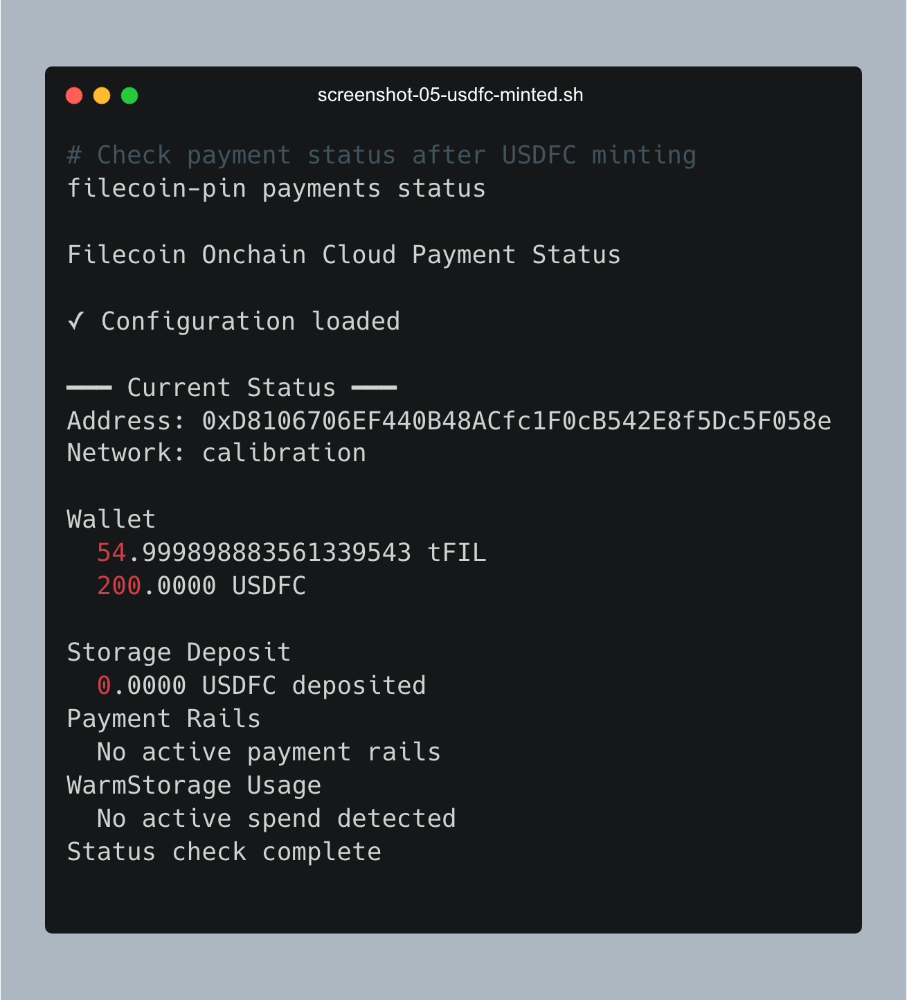
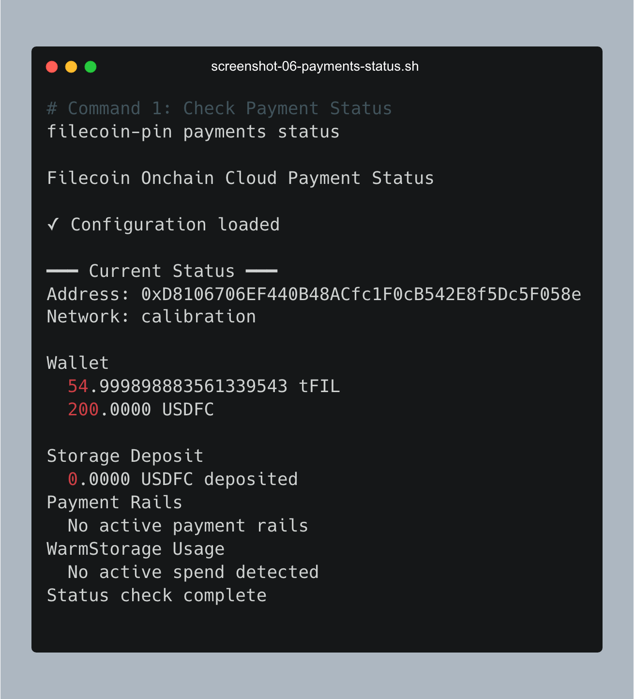
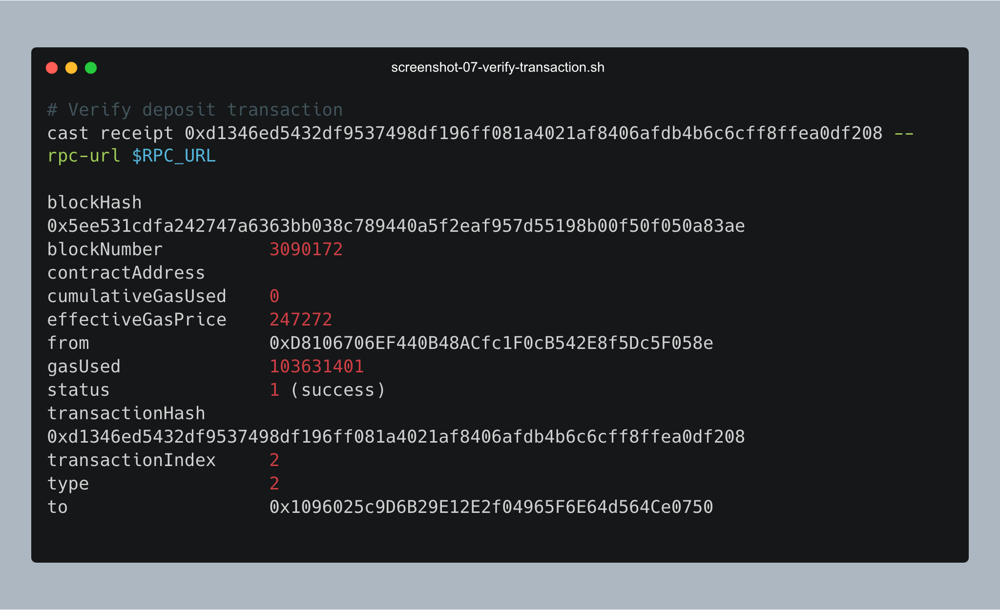
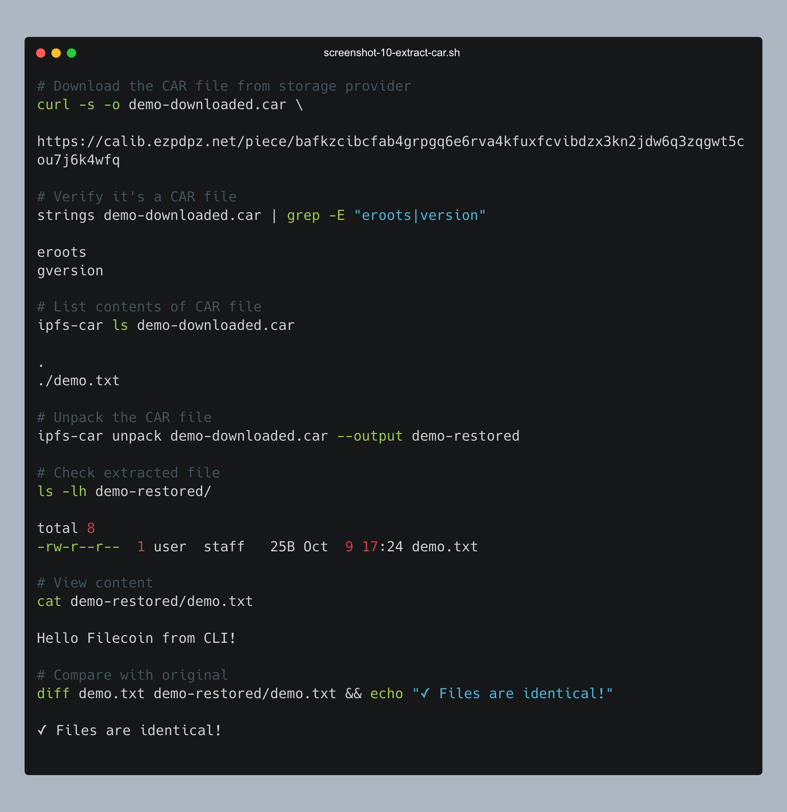
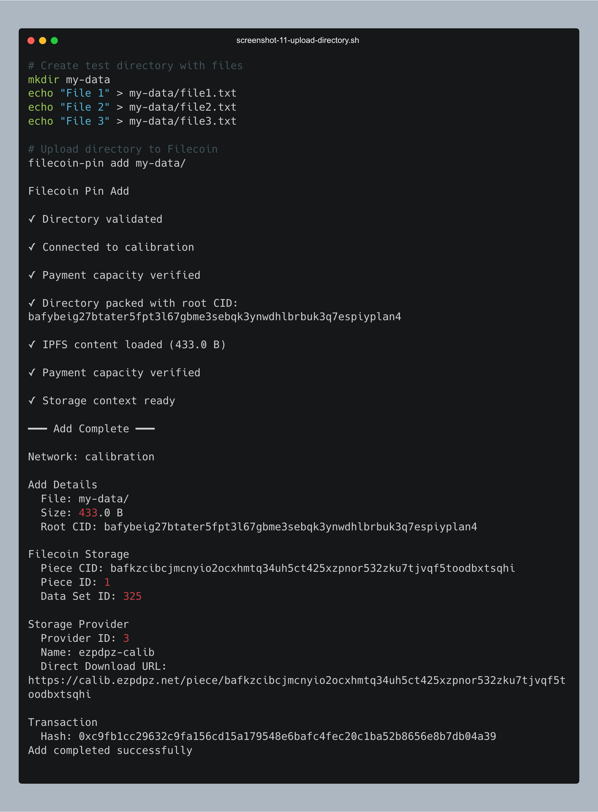
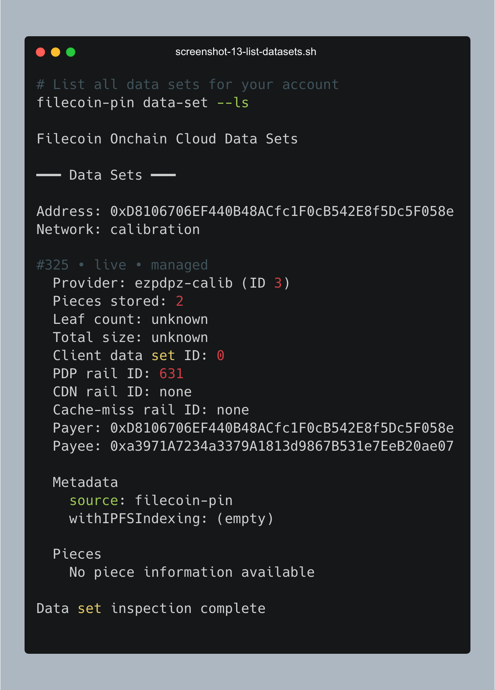
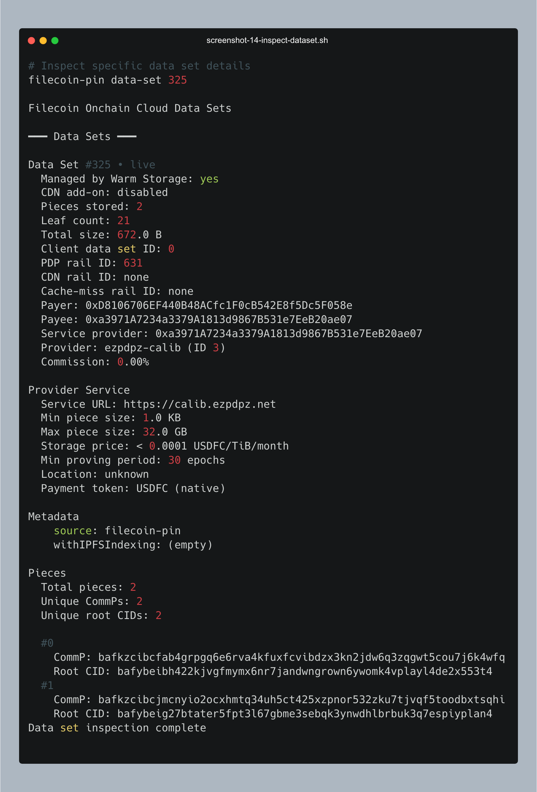
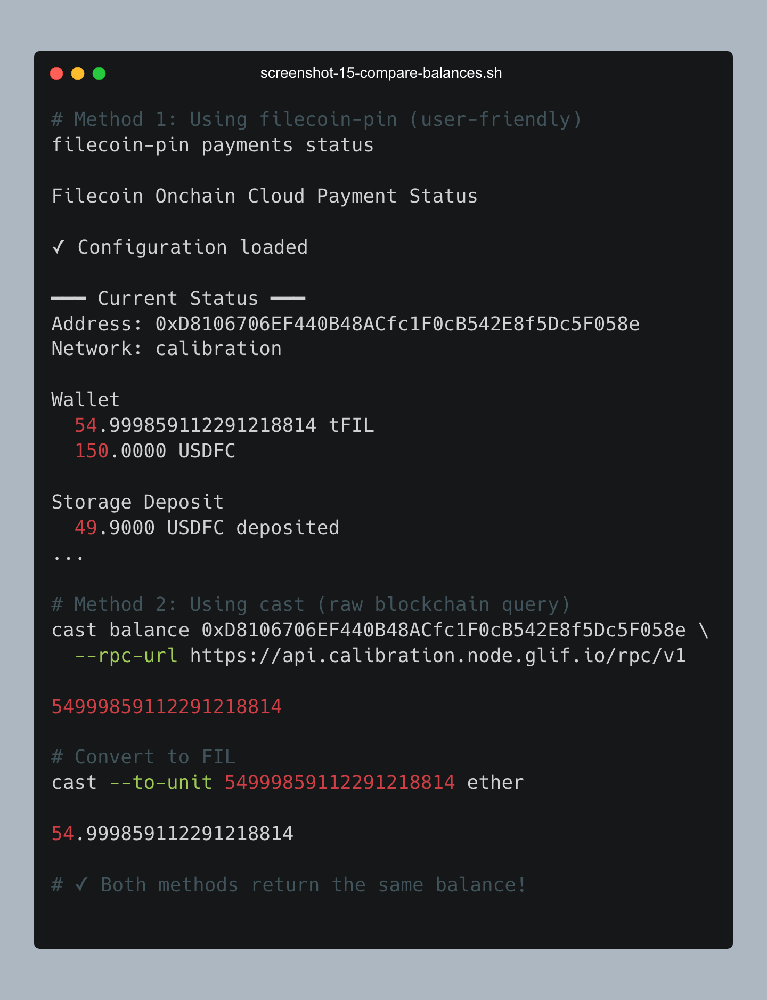

# Filecoin Pin CLI + GitHub Actions Walkthrough
> Update: 10.10.2025 10:00 AM PST

**How to use the Filecoin Pin CLI and creating GitHub Actions from the terminal**

---

> NOTE! For demo purposes, I have created a THROWAWAY PRIVATE KEY.  **NEVER USE YOUR PRIVATE KEY IN A REPOSITORY OR EXPOSE IT**.
> The repo references using your private key LOCALLY as an ENV VARIABLE.
> When you create a GITHUB ACTION, use GITHUB SECRETS to store your private key.

## Who is this for
1. Existing IPFS developers who want to use Filecoin to persist their data
2. Technical users who want to use GitHub Actions to automate deployment of IPFS Files onto decentralized storage
3. Agent builders that want to store their agent cards and validation materials on Filecoin for cryptographic proof of storage

## Why This Walkthrough?

**What You'll Learn:** This walkthrough shows you how to:
1. **Upload IPFS Files to Filecoin** - CLI commands
2. **Pay with stablecoins (USDFC)** - Funds from a crypto wallet and paid from a Smart Contract
3. **Verify cryptographic proof** - Use an Explorer, CLI, or RPC call to verify your data is stored and with whom
4. **Automate with GitHub Actions** - CI/CD pipelines that save to Filecoin automatically

By the end of this walkthrough, you'll have uploaded data to Filecoin, verified it with cryptographic proofs, and automated the entire process with GitHub Actions - all from your terminal (with the exception of getting USDFC/tFIL from a faucet).

---

### How This Walkthrough Works

```
Your File → IPFS CID → CAR Archive → Filecoin Storage → Cryptographic Proofs
   ↓           ↓            ↓              ↓                    ↓
demo.txt   QmXxYy...   Packaged    Stored by SP    Verified on-chain
```

1. **You create a file** → `demo.txt`
2. **IPFS generates a CID** → `QmXxYyZzAaBbCcDdEeFfGg...` (content hash)
3. **Packaged into CAR format** → Content Addressable aRchive for Filecoin
4. **Stored by Filecoin provider** → Decentralized storage infrastructure
5. **Cryptographic proofs submitted** → On-chain verification your data exists
6. **Retrievable via CID** → From any IPFS gateway 


## Overview

This walkthrough demonstrates:
- Using **filecoin-pin CLI** commands directly (no daemon/server required)
- Creating **GitHub Actions** workflows from the command line
- Testing and monitoring workflows with **GitHub CLI (`gh`)**
- Manually checking payment flows and wallet state

---

## Prerequisites

### Install Required Tools

```bash
# Install Node.js 22+ (required for filecoin-pin)
nvm install 22
nvm use 22

# Install filecoin-pin globally
npm install -g filecoin-pin

# Install GitHub CLI
brew install gh  # macOS
# or
sudo apt install gh  # Ubuntu/Debian

# Install Foundry (for cast commands - wallet operations, balance checks, etc.)
curl -L https://foundry.paradigm.xyz | bash
# Then run this in a new terminal:
foundryup
```

### Verify Installation

```bash
filecoin-pin --version
# Expected: filecoin-pin v0.6.0 (or later)

gh --version
# Expected: gh version 2.40.0 (or later)

node --version
# Expected: v22.x.x or higher

cast --version
# Expected: cast 0.2.0 (or later)
```

---

## Part 0: Wallet Setup from Scratch

> **Note**: The `filecoin-pin` CLI does not include wallet creation commands. It expects you to provide a `PRIVATE_KEY` environment variable. This section shows how to create a wallet using standard tools (Node.js or Foundry).

### Step 0.1: Generate a New Wallet

Generate a new Ethereum-compatible private key for Filecoin Calibration testnet:

**Option 1: Using Node.js (built-in)**
```bash
node -e "const crypto = require('crypto'); const pk = '0x' + crypto.randomBytes(32).toString('hex'); console.log('Private Key:', pk);"
```


**Option 2: Using cast (if you have Foundry)**
```bash
cast wallet new
```

**Expected Output:**
```
Private Key: 0x1ef038a399d0bc1b7a1620f42591b2a13a9b5ec5c4a6ac496382b7e60c6a7cc5
```

> **IMPORTANT**: Save this private key securely! This is for TESTNET only.

**Store in environment variable:**
```bash
export PRIVATE_KEY="0x1ef038a399d0bc1b7a1620f42591b2a13a9b5ec5c4a6ac496382b7e60c6a7cc5"
export RPC_URL="https://api.calibration.node.glif.io/rpc/v1"
```

---

### Step 0.2: Get Your Wallet Address

Derive your wallet address from the private key:

**Using cast:**
```bash
cast wallet address --private-key $PRIVATE_KEY
```

**Expected Output:**
```
0xD8106706EF440B48ACfc1F0cB542E8f5Dc5F058e
```



**Store the address:**
```bash
export WALLET_ADDRESS="0xD8106706EF440B48ACfc1F0cB542E8f5Dc5F058e"
echo "Your wallet address: $WALLET_ADDRESS"
```

---

### Step 0.3: Fund Wallet with tFIL (Testnet FIL)

> **Browser Required**: All Calibration faucets now require browser interaction due to CAPTCHA/anti-bot measures. There is no pure CLI method for this step.

Get testnet FIL from one of the available Calibration faucets. This is a brief browser visit - afterwards you can return to CLI-only workflow.

#### Available Calibration Faucets

> **Minimum Required**: You need **~80-100 tFIL** total to mint the minimum 100 USDFC in Step 0.4. Faucets provide different amounts.

**Recommended: ChainSafe Faucet (100 tFIL)**
```bash
open "https://faucet.calibnet.chainsafe-fil.io/funds.html"
```

- Amount: **100 tFIL** per request
- Steps: Enter address → Click "Send"
- Returns: Filecoin message CID (e.g., `bafy2bzace...`)
- Confirmation time: 30-60 seconds

**Alternative: Beryx/Zondax Faucet (10 tFIL)**
```bash
open "https://beryx.zondax.ch/faucet"
```

- Amount: **10 tFIL** per request
- Steps: Select "Calibration" → Enter address → Click "Send"
- Only use for: Small top-ups (would need 8-10 requests for minimum)

**Alternative: Glif Faucet (5 tFIL)**
```bash
open "https://faucet.glif.io/?network=calibration"
```

- Amount: **5 tFIL** per request
- Only use for: Small top-ups if ChainSafe is rate-limited

> **Tip**: Use ChainSafe faucet first. It provides 200 tFIL in one request.

**Confirm Transaction:**

After submitting, you'll receive a Filecoin message CID. Verify it on the explorer:

```bash
# Example: View your transaction (replace with your CID)
open "https://calibration.filfox.info/en/message/bafy2bzace...?t=4"
```

Wait for the transaction to show as confirmed (30-60 seconds).

>> In this demo, I deposited 200 tFIL - I used the faucet twice. So the numbers will not match yours. 100 tFIL should be enough to borrow 200 USDFC, which is the minimum.

#### Verify Funds Arrived

**Option 1: Using cast (requires Foundry):**
```bash
cast balance $WALLET_ADDRESS --rpc-url $RPC_URL
```

**Expected Output:**
```
200000000000000000000
```

**Convert to FIL for readability:**
```bash
cast --to-unit ether $(cast balance $WALLET_ADDRESS --rpc-url $RPC_URL)
```

**Expected Output:**
```
200.000000000000000000
```

**Option 2: Using curl:**
```bash
curl -s -X POST https://api.calibration.node.glif.io/rpc/v1 \
  -H "Content-Type: application/json" \
  -d '{"jsonrpc":"2.0","method":"eth_getBalance","params":["0xD8106706EF440B48ACfc1F0cB542E8f5Dc5F058e","latest"],"id":1}'
```

**Expected Output:**
```json
{
  "id": 1,
  "jsonrpc": "2.0",
  "result": "0x56bc75e2d63100000"
}
```

**Convert hex to FIL:**
```bash
node -e "const bal = BigInt('0x56bc75e2d63100000'); console.log('Balance:', Number(bal) / 1e18, 'FIL');"
```

**Expected Output:**
```
Balance: 200 FIL
```

**Option 3 (Recommended): Using filecoin-pin CLI (checks both FIL and USDFC):**
```bash
filecoin-pin payments status --private-key $PRIVATE_KEY --rpc-url $RPC_URL
```

**Expected Output (after ChainSafe faucet 2x - 200 tFIL):**
```
Filecoin Onchain Cloud Payment Status

━━━ Current Status ━━━

Address: 0xD8106706EF440B48ACfc1F0cB542E8f5Dc5F058e
Network: calibration

Balances:
  FIL: 200.00 tFIL (or more if you used multiple faucets)
  USDFC wallet: 0.00 USDFC
  USDFC deposited: 0.00 USDFC

No USDFC tokens found
```

> Option 3 (`filecoin-pin payments status`) will check complete payment setup throughout this walkthrough

**Example Transaction:**

Your ChainSafe faucet request returned:
```
bafy2bzacecurhcszpsaykcduni4wxrx2tkjb5nx7ji6hklwdjivtm64fcvbng
```

View on explorer (use your own transaction ID)
```bash
open "https://calibration.filfox.info/en/message/bafy2bzacecurhcszpsaykcduni4wxrx2tkjb5nx7ji6hklwdjivtm64fcvbng?t=4"
```

**You now have 200+ tFIL!** Ready for USDFC minting.

---

### Step 0.4: Get USDFC (Testnet Stablecoin)

USDFC is required for Filecoin storage payments. You need to mint it using FIL as collateral.

**Using MetaMask + USDFC Web App**

**Step 1: Import wallet to MetaMask**
1. Open MetaMask browser extension
2. Click account icon → "Import Account"
3. Select "Private Key" method
4. Paste: `0x1ef038a399d0bc1b7a1620f42591b2a13a9b5ec5c4a6ac496382b7e60c6a7cc5`


**Step 2: Add Filecoin Calibration network to MetaMask**
- Network Name: `Filecoin Calibration`
- RPC URL: `https://api.calibration.node.glif.io/rpc/v1`
- Chain ID: `314159`
- Currency Symbol: `tFIL`
- Block Explorer: `https://calibration.filfox.info`

**Step 3: Open USDFC app**
```bash
open "https://stg.usdfc.net"
```

**Step 4: Open a Trove (mint USDFC)**

 


1. Connect MetaMask wallet
2. Click "Open Trove"
3. Enter collateral: `150 FIL`
4. Enter borrow amount: `200 USDFC` (minimum)
5. Review collateral ratio (should be >150%)
6. Confirm transaction in MetaMask
7. Wait for confirmation (~30-60 seconds)

**You now have 200 USDFC!**

**Verify USDFC balance:**
```bash
filecoin-pin payments status
```



**Expected Output:**
```
Filecoin Onchain Cloud Payment Status

✓ Configuration loaded

━━━ Current Status ━━━
Address: 0xD8106706EF440B48ACfc1F0cB542E8f5Dc5F058e
Network: calibration

Wallet
  54.999898883561339543 tFIL
  200.0000 USDFC

Storage Deposit
  0.0000 USDFC deposited
Payment Rails
  No active payment rails
WarmStorage Usage
  No active spend detected
Status check complete
```

**What happened:**
- Locked ~150 FIL as collateral
- Minted 200 USDFC
- Remaining: ~50 tFIL for gas fees
- Next: Deposit USDFC for storage

---

### Step 0.5: Create Environment File

> I put my private key on this repo for DEMO purposes.  It is a TESTNET KEY.  **NEVER USE YOUR PRIVATE KEY IN A REPOSITORY OR EXPOSE IT**.

Save your credentials **locally** for easy reuse:

```bash
cat > ~/.filecoin-pin-env << 'EOF'
export PRIVATE_KEY="0x1ef038a399d0bc1b7a1620f42591b2a13a9b5ec5c4a6ac496382b7e60c6a7cc5"
export WALLET_ADDRESS="0xD8106706EF440B48ACfc1F0cB542E8f5Dc5F058e"
export RPC_URL="https://api.calibration.node.glif.io/rpc/v1"
EOF

# Load variables
source ~/.filecoin-pin-env

# Verify
echo "Wallet: $WALLET_ADDRESS"
echo "Private Key: ${PRIVATE_KEY:0:10}..."
echo "RPC URL: $RPC_URL"
```

---

## Part 1: Filecoin Pin CLI Commands

All commands in this section use the environment variables set in Part 0 (Step 0.5). If you're starting a new terminal session, reload them:

```bash
source ~/.filecoin-pin-env
```

> **Note:** These commands work directly without running a server/daemon. The `PRIVATE_KEY` and `RPC_URL` environment variables must be set.

---

### Command 1: Check Payment Status

Check your current payment configuration and balance:

```bash
filecoin-pin payments status
```



**Expected Output (before setup):**
```
Filecoin Onchain Cloud Payment Status

✓ Configuration loaded

━━━ Current Status ━━━
Address: 0xD8106706EF440B48ACfc1F0cB542E8f5Dc5F058e
Network: calibration

Wallet
  54.999898883561339543 tFIL
  200.0000 USDFC

Storage Deposit
  0.0000 USDFC deposited
Payment Rails
  No active payment rails
WarmStorage Usage
  No active spend detected
Status check complete
```

**What this shows:**
- **Address**: Your wallet address (0xD8106706EF440B48ACfc1F0cB542E8f5Dc5F058e)
- **FIL balance**: ~55 tFIL remaining (after collateral for USDFC)
- **USDFC wallet**: 200 USDFC available
- **Storage Deposit**: 0 USDFC deposited (needs setup)
- **Payment Rails**: None configured yet
- **Next**: Run `payments setup` to deposit USDFC and configure rails

---

### Command 2: Setup Payments (First Time Only)

Configure payment approvals and deposit USDFC for storage:

```bash
filecoin-pin payments setup --auto --deposit 50
```

> **What `--auto` does**: Automatically handles both permission setup AND deposit in one command. Without `--auto`, you'd need to manually confirm each step. Perfect for first-time setup and CI/CD pipelines.

> ⏱️ **Expected Duration**: 2-5 minutes (waiting for blockchain confirmation)

**Expected Output (initial):**
```
Filecoin Onchain Cloud Payment Setup

Running in auto mode...

✓ Connected to calibration

✓ Balance check complete

Account:
  Wallet: 0xD8106706EF440B48ACfc1F0cB542E8f5Dc5F058e
  Network: calibration
Balances:
  FIL: 54.9999 tFIL
  USDFC wallet: 200.0000 USDFC
  USDFC deposited: 0.0000 USDFC
✓ WarmStorage permissions configured

Transaction:
  0xf61d885b2316589efdcc6637e8b17c06c1439fefd626ba121a08023c0ebaf2a1

[Waiting for transaction confirmation...]
```

> **What's happening**: The command submits a transaction to the blockchain and waits for it to be mined. Calibration testnet block times vary, so this typically takes **2-5 minutes**. The command will wait until confirmation before proceeding.

**Expected Output (after confirmation):**
```
Deposit successful (50.0000 USDFC)

━━━ Configuration Summary ━━━

Network: calibration
Deposit: 50.0000 USDFC
Storage: ~27.3 TiB for 1 month
Status: Ready to upload
```

**What happens:**
1. Connects to Calibration network
2. Checks wallet balances
3. Configures WarmStorage contract permissions
4. Submits deposit transaction to blockchain
5. **Waits for transaction confirmation (2-5 minutes)**
6. Confirms deposit successful

**Verify transactions on blockchain:**

The command creates two transactions. You can verify each one:

**Option 1: View in browser (Explorer)**
```bash
# Permission setup transaction
open "https://calibration.filfox.info/tx/0xf61d885b2316589efdcc6637e8b17c06c1439fefd626ba121a08023c0ebaf2a1"

# Deposit transaction
open "https://calibration.filfox.info/tx/0xd1346ed5432df9537498df196ff081a4021af8406afdb4b6c6cff8ffea0df208"
```

**Option 2: Verify from CLI (using cast)**
```bash
# Check permission setup transaction
cast receipt 0xf61d885b2316589efdcc6637e8b17c06c1439fefd626ba121a08023c0ebaf2a1 --rpc-url $RPC_URL
```

**Expected Output:**
```
blockHash            0x45c6f5eb9fc51cdaf9cbf3f9f0f26386bbee937a55349627637efba196001245
blockNumber          3090160
contractAddress
cumulativeGasUsed    0
effectiveGasPrice    136631
from                 0xD8106706EF440B48ACfc1F0cB542E8f5Dc5F058e
gasUsed              31510988
status               1 (success)
transactionHash      0xf61d885b2316589efdcc6637e8b17c06c1439fefd626ba121a08023c0ebaf2a1
transactionIndex     18
type                 2
to                   0x1096025c9D6B29E12E2f04965F6E64d564Ce0750
```

**What to check:**
- ✅ **status**: `1 (success)` means transaction succeeded
- ✅ **from**: Your wallet address (0xD8106706EF440B48ACfc1F0cB542E8f5Dc5F058e)
- ✅ **gasUsed**: Amount of gas consumed (31510988)
- ✅ **blockNumber**: Transaction is confirmed on-chain (block 3090160)
- ✅ **to**: WarmStorage contract (0x1096025c9D6B29E12E2f04965F6E64d564Ce0750)

```bash
# Check deposit transaction
cast receipt 0xd1346ed5432df9537498df196ff081a4021af8406afdb4b6c6cff8ffea0df208 --rpc-url $RPC_URL
```



**Expected Output:**
```
blockHash            0x5ee531cdfa242747a6363bb038c789440a5f2eaf957d55198b00f50f050a83ae
blockNumber          3090172
contractAddress
cumulativeGasUsed    0
effectiveGasPrice    247272
from                 0xD8106706EF440B48ACfc1F0cB542E8f5Dc5F058e
gasUsed              103631401
status               1 (success)
transactionHash      0xd1346ed5432df9537498df196ff081a4021af8406afdb4b6c6cff8ffea0df208
transactionIndex     2
type                 2
to                   0x1096025c9D6B29E12E2f04965F6E64d564Ce0750
```

**What to check:**
- ✅ **status**: `1 (success)` means transaction succeeded
- ✅ **blockNumber**: Confirmed 12 blocks after permissions (3090172)
- ✅ **gasUsed**: Deposit uses more gas than permissions (103631401)

> 💡 **Note**: The `cast receipt` command shows the transaction succeeded but doesn't display the deposit amount (50 USDFC) in a human-readable format. To verify the actual deposit, use `filecoin-pin payments status` (shown below).

> 📝 **Note**: The setup command **automatically performs two transactions in sequence**:
> 1. Configure WarmStorage permissions (~1-2 minutes)
> 2. Deposit USDFC (~1-2 minutes)
>
> You only need to run the command **once** - it handles both transactions automatically. The total wait time is typically 3-5 minutes for both transactions to confirm.

**Verify setup completed:**
```bash
filecoin-pin payments status
```

**Expected Output (after setup):**
```
Filecoin Onchain Cloud Payment Status

✓ Configuration loaded

━━━ Current Status ━━━
Address: 0xD8106706EF440B48ACfc1F0cB542E8f5Dc5F058e
Network: calibration

Wallet
  54.9999 tFIL
  150.0000 USDFC

Storage Deposit
  50.0000 USDFC deposited
Payment Rails
  Active payment rails configured
WarmStorage Usage
  Ready to upload
Status check complete
```

✅ **You're now ready to upload files to Filecoin!**

---

### Command 2b: Automatic Funding with --auto-fund Flag (v0.7.0+)

> **Version requirement**: `--auto-fund` flag is available in v0.7.0 and later. Check your version with `filecoin-pin -V`.

Instead of managing deposits separately, use `--auto-fund` with `add` or `import` commands to automatically ensure 10-day payment runway before each upload:

```bash
# Upload file with automatic funding
filecoin-pin add --auto-fund demo.txt

# Upload directory with automatic funding
filecoin-pin add --auto-fund my-data/

# Import CAR with automatic funding
filecoin-pin import --auto-fund archive.car
```

**What `--auto-fund` does:**
1. **Pre-flight check** - Before upload, checks if your current deposit can maintain 10+ days runway AFTER this upload
2. **Smart calculation** - Factors in the NEW file's lockup + ongoing storage costs
3. **Automatic deposit** - If insufficient, deposits exact amount needed to reach 10 days
4. **Seamless upload** - Continues with upload after funding adjustment

**How it calculates:**
```
CurrentAvailable = Deposited - LockedForExistingFiles
NewFileCost = NewFileLockup + (NewFileStorageCost * 10 days)
TotalNeeded = CurrentAvailable + NewFileCost

If TotalNeeded > CurrentDeposit:
  Deposit = TotalNeeded - CurrentDeposit
```

**Expected Output (sufficient funds):**
```
✓ Funding requirements met
```

**Expected Output (needs funding):**
```
✓ Funding requirements met

Auto-funding completed:
  Deposited 6.4 USDFC
  Total deposited: 11.4 USDFC
  Runway: ~10 day(s) 2 hour(s)
  Approval tx: 0x123...
  Transaction: 0x456...
```

**When to use `--auto-fund`:**
- ✅ CI/CD pipelines - Ensures consistent 10-day runway automatically
- ✅ Automated workflows - "Set it and forget it" funding management
- ✅ After initial setup - Maintains minimum runway without manual tracking
- ✅ Multiple small uploads - Each upload checks and tops up if needed

**When NOT to use `--auto-fund`:**
- ❌ You want > 10 days runway (use `payments fund --days N` instead)
- ❌ You want manual control over deposits
- ❌ You're uploading many tiny files rapidly (overhead of checking each time)
- ❌ You want to optimize for gas costs (batch deposits manually)

> ⚠️ **Important**: `--auto-fund` is a flag for `add` and `import` commands, NOT for `payments setup`.

**Comparison with manual funding:**

| Aspect | `add --auto-fund` | `payments fund --days N` |
|--------|-------------------|--------------------------|
| **When** | Before each upload | Manually when you run it |
| **Target runway** | Fixed 10 days | Configurable (N days) |
| **Knows about new file** | Yes (calculates for upload) | No (based on current usage) |
| **Use case** | Per-upload automation | Manual runway management |

---

### Command 2c: Manual Payment Runway Adjustment

Manually adjust your payment runway after uploading files (alternative to `--auto-fund`):

**Set exact runway in days:**
```bash
filecoin-pin payments fund --exact-days 57
```

**What this does:**
1. Checks current deposit and actual spending rate (based on uploaded files)
2. Calculates USDFC needed for exactly 57 days of runway
3. **Deposits additional funds** if current runway < 57 days
4. **Withdraws excess funds** if current runway > 57 days

**Expected Output (needs more funds):**
```
Filecoin Onchain Cloud Payment Funding

Current Status:
  Deposited: 5.0 USDFC
  Daily cost: 0.2 USDFC
  Current runway: 25 days

Target: 57 days runway
Required deposit: 11.4 USDFC

Action: Deposit additional 6.4 USDFC

✓ Deposit transaction submitted
✓ New deposit: 11.4 USDFC
✓ New runway: 57 days
```

**Expected Output (has excess funds):**
```
Filecoin Onchain Cloud Payment Funding

Current Status:
  Deposited: 50.0 USDFC
  Daily cost: 0.1 USDFC
  Current runway: 500 days

Target: 57 days runway
Required deposit: 5.7 USDFC

Action: Withdraw 44.3 USDFC

✓ Withdrawal transaction submitted
✓ New deposit: 5.7 USDFC
✓ New runway: 57 days
```

**Set exact deposit amount:**
```bash
filecoin-pin payments fund --exact-amount 100
```

**What this does:**
- Sets your total deposit to **exactly 100 USDFC**
- Adds funds if current deposit < 100
- Withdraws if current deposit > 100

**Expected Output:**
```
Filecoin Onchain Cloud Payment Funding

Current deposit: 50.0 USDFC
Target deposit: 100.0 USDFC

Action: Deposit additional 50.0 USDFC

✓ Deposit transaction submitted
✓ New deposit: 100.0 USDFC
✓ Estimated runway: 1000 days (at current usage rate)
```

---

### When to Use Setup vs Fund vs Auto-Fund

| Scenario | Command | Why |
|----------|---------|-----|
| **First time ever** | `payments setup --auto --deposit 50` | Initial setup + permissions + specific deposit |
| **New wallet** | `payments setup --auto --deposit 100` | Need to configure permissions for new address |
| **Automated uploads (CI/CD)** | `add --auto-fund <file>` | Auto-maintains 10-day runway before each upload |
| **After uploading files manually** | `payments fund --days 60` | Adjust based on ACTUAL usage after uploading data |
| **Want longer runway** | `payments fund --days 90` | Set specific runway > 10 days |
| **Running low on funds** | `payments fund --days 30` | Top up without reconfiguring permissions |
| **Withdraw excess** | `payments fund --amount 20` | Reduce deposit if you over-funded initially |

> ⚠️ **Important**: You only run `setup` **once per wallet** to configure permissions. After that, use either `add --auto-fund` (automatic) or `payments fund` (manual) to manage deposits.

**Recommended Workflow Option 1: Automatic (with --auto-fund)**

1. **Initial setup**: `payments setup --auto --deposit 50`
2. **Upload with auto-funding**: `add --auto-fund myfile.txt`
3. **Monitor**: `payments status` (check current runway)
4. **Repeat step 2** as needed - auto-funding maintains 10-day minimum

**Recommended Workflow Option 2: Manual (without --auto-fund)**

1. **Initial setup**: `payments setup --auto --deposit 100`
2. **Upload files**: `add myfile.txt` (multiple times as needed)
3. **Adjust funding**: `payments fund --days 30` (adjusts based on your actual usage)
4. **Monitor**: `payments status` (check current runway)
5. **Repeat steps 2-4** as you upload more files

**Use Case Example - GitHub Actions with Auto-Fund:**

```yaml
- name: Upload to Filecoin (with auto-funding)
  run: filecoin-pin add --auto-fund ./dist
```

**Use Case Example - GitHub Actions with Manual Fund:**

```yaml
- name: Upload to Filecoin
  run: filecoin-pin add ./dist

- name: Ensure 30-day runway
  run: filecoin-pin payments fund --days 30
```

The auto-fund approach is simpler (one command), while manual funding gives you more control over runway duration.

---

### Command 3: Upload a File to Filecoin

Create a CAR file and upload it to Filecoin with PDP proofs:

```bash
# Create test file
echo "Hello Filecoin from CLI!" > demo.txt

# Upload to Filecoin
filecoin-pin add demo.txt
```

> ⏱️ **Expected Duration**: 2-5 minutes (waiting for blockchain confirmation)

**Expected Output:**
```
Filecoin Pin Add

✓ File validated (25.0 B)

✓ Connected to calibration

✓ WarmStorage permissions configured

  Transaction: 0x0800c4e4730b781ea634456b99e49dc0069c76a95137fef79dc6b4d281133d8a
✓ Payment capacity verified

✓ File packed with root CID: bafybeibh422kjvgfmymx6nr7jandwngrown6ywomk4vplayl4de2x553t4

✓ IPFS content loaded (214.0 B)

✓ Payment capacity verified

✓ Storage context ready

━━━ Add Complete ━━━

Network: calibration

Add Details
  File: demo.txt
  Size: 214.0 B
  Root CID: bafybeibh422kjvgfmymx6nr7jandwngrown6ywomk4vplayl4de2x553t4

Filecoin Storage
  Piece CID: bafkzcibcfab4grpgq6e6rva4kfuxfcvibdzx3kn2jdw6q3zqgwt5cou7j6k4wfq
  Piece ID: 0
  Data Set ID: 325

Storage Provider
  Provider ID: 3
  Name: ezpdpz-calib
  Direct Download URL: https://calib.ezpdpz.net/piece/bafkzcibcfab4grpgq6e6rva4kfuxfcvibdzx3kn2jdw6q3zqgwt5cou7j6k4wfq

Transaction
  Hash: 0xc85e49d2ed745cc8c5d7115e7c45a1243ec25da7e73e224a744887783afea42b
Add completed successfully
```

**Key values explained:**
- **Root CID**: `bafybeibh422kjvgfmymx6nr7jandwngrown6ywomk4vplayl4de2x553t4` - IPFS content identifier for your data
- **Piece CID**: `bafkzcibcfab4grpgq6e6rva4kfuxfcvibdzx3kn2jdw6q3zqgwt5cou7j6k4wfq` - Filecoin piece commitment (cryptographic proof)
- **Piece ID**: `0` - Reference within the data set
- **Data Set ID**: `325` - On-chain data set containing your upload
- **Transaction**: `0xc85e49d2ed745cc8c5d7115e7c45a1243ec25da7e73e224a744887783afea42b` - Blockchain confirmation hash
- **Direct Download URL**: Direct link to retrieve your data from the storage provider

**Verify the upload by downloading and validating the CAR file:**

```bash
# Download the CAR file from storage provider
curl -s -o demo-downloaded.txt https://calib.ezpdpz.net/piece/bafkzcibcfab4grpgq6e6rva4kfuxfcvibdzx3kn2jdw6q3zqgwt5cou7j6k4wfq

# Check file was downloaded
ls -lh demo-downloaded.txt

# Verify it's a CAR file (check for CAR header markers)
strings demo-downloaded.txt | grep -E "eroots|version"

# Verify content is present
grep -a "Hello Filecoin from CLI!" demo-downloaded.txt
```

**Expected Output:**
```
-rw-r--r--  1 user  staff   214B Oct  9 14:45 demo-downloaded.txt

eroots
gversion

Hello Filecoin from CLI!
```


**What we verified:**
- ✅ File downloaded successfully (214 bytes)
- ✅ Valid CAR file format (contains `eroots` and `version` header markers)
- ✅ Original content is preserved in the CAR file

**Extract and verify the original file from the CAR:**

First, install `ipfs-car` tool (one-time setup):
```bash
npm install -g ipfs-car
```

Download, verify, and unpack:
```bash
# Download the CAR file
curl -s -o demo-downloaded.car https://calib.ezpdpz.net/piece/bafkzcibcfab4grpgq6e6rva4kfuxfcvibdzx3kn2jdw6q3zqgwt5cou7j6k4wfq

# Verify it's a CAR file
strings demo-downloaded.car | grep -E "eroots|version"

# List contents of CAR file
ipfs-car ls demo-downloaded.car

# Unpack the CAR file
ipfs-car unpack demo-downloaded.car --output demo-restored

# Check extracted file
ls -lh demo-restored/

# View content
cat demo-restored/demo.txt

# Compare with original
diff demo.txt demo-restored/demo.txt && echo "✓ Files are identical!"
```

**Expected Output:**
```
eroots
gversion

.
./demo.txt

total 8
-rw-r--r--  1 user  staff   25B Oct  9 17:24 demo.txt

Hello Filecoin from CLI!

✓ Files are identical!
```



**What we verified:**
- ✅ Valid CAR file format (contains `eroots` and `version` markers)
- ✅ File structure preserved (`./demo.txt`)
- ✅ Content extracted successfully
- ✅ Content matches original file exactly

> 💡 **Note**: The `ipfs-car` tool is a simple, maintained package that can pack and unpack CAR files without custom scripts. It works for both files and directories.

✅ **Your file is now permanently stored on Filecoin with ongoing proof of possession, and you can retrieve and verify it anytime!**

---

### Command 4: Upload Directory

Package multiple files into a single CAR:

```bash
# Create test directory
mkdir my-data
echo "File 1" > my-data/file1.txt
echo "File 2" > my-data/file2.txt
echo "File 3" > my-data/file3.txt

# Upload entire directory
filecoin-pin add my-data/
```

> ⏱️ **Expected Duration**: 2-5 minutes (waiting for blockchain confirmation)

**Expected Output:**
```
Filecoin Pin Add

✓ Directory validated

✓ Connected to calibration

✓ Payment capacity verified

✓ Directory packed with root CID: bafybeig27btater5fpt3l67gbme3sebqk3ynwdhlbrbuk3q7espiyplan4

✓ IPFS content loaded (433.0 B)

✓ Payment capacity verified

✓ Storage context ready

━━━ Add Complete ━━━

Network: calibration

Add Details
  File: my-data/
  Size: 433.0 B
  Root CID: bafybeig27btater5fpt3l67gbme3sebqk3ynwdhlbrbuk3q7espiyplan4

Filecoin Storage
  Piece CID: bafkzcibcjmcnyio2ocxhmtq34uh5ct425xzpnor532zku7tjvqf5toodbxtsqhi
  Piece ID: 1
  Data Set ID: 325

Storage Provider
  Provider ID: 3
  Name: ezpdpz-calib
  Direct Download URL: https://calib.ezpdpz.net/piece/bafkzcibcjmcnyio2ocxhmtq34uh5ct425xzpnor532zku7tjvqf5toodbxtsqhi

Transaction
  Hash: 0xc9fb1cc29632c9fa156cd15a179548e6bafc4fec20c1ba52b8656e8b7db04a39
Add completed successfully
```



**Key details:**
- **Root CID**: `bafybeig27btater5fpt3l67gbme3sebqk3ynwdhlbrbuk3q7espiyplan4` - IPFS directory structure
- **Size**: 433.0 B - Includes all files plus directory metadata
- **Piece ID**: `1` - Second piece in the same Data Set ID 325
- **Data Set ID**: `325` - Same data set as the single file upload (multiple pieces grouped together)

> 💡 **Note**: Multiple uploads to the same payment configuration are grouped into the same Data Set, with each upload assigned a unique Piece ID.

**Verify the directory upload by downloading and unpacking:**

First, install `ipfs-car` tool (one-time setup):
```bash
npm install -g ipfs-car
```

Download, verify, and unpack:
```bash
# Download the CAR file
curl -s -o my-data-downloaded.car https://calib.ezpdpz.net/piece/bafkzcibcjmcnyio2ocxhmtq34uh5ct425xzpnor532zku7tjvqf5toodbxtsqhi

# Verify it's a CAR file
strings my-data-downloaded.car | grep -E "eroots|version"

# List contents of CAR file
ipfs-car ls my-data-downloaded.car

# Unpack the CAR file
ipfs-car unpack my-data-downloaded.car --output my-data-restored

# Verify extracted files
ls -lh my-data-restored/

# Compare with original
diff -r my-data/ my-data-restored/ && echo "✓ Directories are identical!"
```

**Expected Output:**
```
eroots
ogversion

.
./file1.txt
./file2.txt
./file3.txt

total 24
-rw-r--r--  1 user  staff   7B Oct  9 17:22 file1.txt
-rw-r--r--  1 user  staff   7B Oct  9 17:22 file2.txt
-rw-r--r--  1 user  staff   7B Oct  9 17:22 file3.txt

Directories are identical!
```


**What we verified:**
- ✅ Valid CAR file format (contains `eroots` and `version` markers)
- ✅ Directory structure preserved (3 files in correct hierarchy)
- ✅ All files extracted successfully
- ✅ Content matches original directory exactly

> 💡 **Note**: The `ipfs-car` tool is a simple, maintained package that can pack and unpack CAR files without custom scripts. It works for both files and directories.

---

### Command 5: Import Existing CAR File

Upload a pre-created CAR file:

```bash
filecoin-pin import existing-archive.car
```

**Expected Output:**
```
✓ Reading CAR file...
✓ Uploading to Filecoin...
✓ Upload complete

CommP: bafk2bzaced...
Root ID: 44
Size: 2.5 MB
Transaction: 0x...
```

---

### Command 6: List All Data Sets

View all data sets you've created:

> FYI `filecoin-pin data-set --ls` might be changing to filecoin-pin data list
> Tracking at https://github.com/filecoin-project/filecoin-pin/issues/66

```bash
filecoin-pin data-set --ls
```

**Expected Output:**
```
Filecoin Onchain Cloud Data Sets

━━━ Data Sets ━━━

Address: 0xD8106706EF440B48ACfc1F0cB542E8f5Dc5F058e
Network: calibration

#325 • live • managed
  Provider: ezpdpz-calib (ID 3)
  Pieces stored: 2
  Leaf count: unknown
  Total size: unknown
  Client data set ID: 0
  PDP rail ID: 631
  CDN rail ID: none
  Cache-miss rail ID: none
  Payer: 0xD8106706EF440B48ACfc1F0cB542E8f5Dc5F058e
  Payee: 0xa3971A7234a3379A1813d9867B531e7EeB20ae07

  Metadata
    source: filecoin-pin
    withIPFSIndexing: (empty)

  Pieces
    No piece information available

Data set inspection complete
```



**Key information:**
- **Data Set #325**: Contains all our uploads (both the single file and directory)
- **Pieces stored: 2**: One piece for `demo.txt`, one for `my-data/` directory
- **Provider**: ezpdpz-calib (ID 3) - The storage provider managing our data
- **PDP rail ID: 631**: Active payment rail for storage proofs
- **Status**: `live • managed` - Data set is active with ongoing proofs

> 💡 **Note**: Multiple uploads using the same payment configuration are grouped into a single data set. Each upload becomes a separate "piece" within that data set.

---

### Command 7: Inspect Specific Data Set

Get detailed information about a specific data set (this queries the blockchain directly):

```bash
filecoin-pin data-set 325
```

**Expected Output:**
```
Filecoin Onchain Cloud Data Sets

━━━ Data Sets ━━━

Data Set #325 • live
  Managed by Warm Storage: yes
  CDN add-on: disabled
  Pieces stored: 2
  Leaf count: 21
  Total size: 672.0 B
  Client data set ID: 0
  PDP rail ID: 631
  CDN rail ID: none
  Cache-miss rail ID: none
  Payer: 0xD8106706EF440B48ACfc1F0cB542E8f5Dc5F058e
  Payee: 0xa3971A7234a3379A1813d9867B531e7EeB20ae07
  Service provider: 0xa3971A7234a3379A1813d9867B531e7EeB20ae07
  Provider: ezpdpz-calib (ID 3)
  Commission: 0.00%

Provider Service
  Service URL: https://calib.ezpdpz.net
  Min piece size: 1.0 KB
  Max piece size: 32.0 GB
  Storage price: < 0.0001 USDFC/TiB/month
  Min proving period: 30 epochs
  Location: unknown
  Payment token: USDFC (native)

Metadata
    source: filecoin-pin
    withIPFSIndexing: (empty)

Pieces
  Total pieces: 2
  Unique CommPs: 2
  Unique root CIDs: 2

  #0
    CommP: bafkzcibcfab4grpgq6e6rva4kfuxfcvibdzx3kn2jdw6q3zqgwt5cou7j6k4wfq
    Root CID: bafybeibh422kjvgfmymx6nr7jandwngrown6ywomk4vplayl4de2x553t4
  #1
    CommP: bafkzcibcjmcnyio2ocxhmtq34uh5ct425xzpnor532zku7tjvqf5toodbxtsqhi
    Root CID: bafybeig27btater5fpt3l67gbme3sebqk3ynwdhlbrbuk3q7espiyplan4
Data set inspection complete
```



**Key information explained:**

**Data Set Status:**
- **live** - Data set is active with ongoing PDP proofs
- **Pieces stored: 2** - Our demo.txt (#0) and my-data/ directory (#1)
- **Leaf count: 21** - Total Merkle tree leaves across all pieces
- **Total size: 672.0 B** - Combined size of both pieces

**Payment Rails:**
- **PDP rail ID: 631** - Active payment rail for storage proofs
- **Payer/Payee** - Payment flows from your wallet to the provider
- **Commission: 0.00%** - No commission on this testnet provider

**Provider Details:**
- **Service URL**: Direct access to download pieces
- **Storage price**: < 0.0001 USDFC/TiB/month (very low for testnet)
- **Min proving period: 30 epochs** - Proofs submitted every 15 minutes

**Pieces:**
- Each piece shows its CommP (Filecoin piece CID) and Root CID (IPFS content ID)
- Piece #0 = demo.txt (our single file upload)
- Piece #1 = my-data/ (our directory upload)

> 💡 **Note**: This command queries the smart contracts on-chain to retrieve all data set information. The data shown is live blockchain state, not cached data.

---

## Part 2: Manual Payment and Wallet Checks

This section demonstrates that `filecoin-pin` queries live blockchain data, not cached information.

### Check Wallet Balance - Comparison of Methods

**Method 1: Using filecoin-pin (user-friendly)**

```bash
filecoin-pin payments status
```

**Expected Output:**
```
Filecoin Onchain Cloud Payment Status

✓ Configuration loaded

━━━ Current Status ━━━
Address: 0xD8106706EF440B48ACfc1F0cB542E8f5Dc5F058e
Network: calibration

Wallet
  54.999859112291218814 tFIL
  150.0000 USDFC

Storage Deposit
  49.9000 USDFC deposited
  Capacity: ~27.2 TiB/month (includes 10-day safety reserve)
Payment Rails
  1 active, 0 terminated
  Daily cost: 0.0000000001 USDFC
  Monthly cost: 0.000000003 USDFC
  Pending settlement: 0.0000000000 USDFC
  1 rail(s) need settlement
WarmStorage Usage
  Spend rate: 0.0000000000 USDFC/epoch
  Locked: 0.000000001 USDFC (~10-day reserve)
  Runway: ~1342123288 year(s) 8 month(s) 12 day(s)
Status check complete
```

**Method 2: Using cast (raw blockchain query)**

```bash
# Query balance in wei (smallest unit)
cast balance 0xD8106706EF440B48ACfc1F0cB542E8f5Dc5F058e \
  --rpc-url https://api.calibration.node.glif.io/rpc/v1
```

**Expected Output:**
```
54999859112291218814
```

**Convert to FIL:**
```bash
cast --to-unit 54999859112291218814 ether
```

**Expected Output:**
```
54.999859112291218814
```



**Comparison result:**
- ✅ `filecoin-pin payments status`: **54.999859112291218814 tFIL**
- ✅ `cast balance`: **54.999859112291218814 FIL**
- ✅ **Both return identical values** - confirming `filecoin-pin` queries live blockchain state

> 💡 **Note**: This proves that `filecoin-pin payments status` queries the blockchain directly via RPC, not from a cached database. The balances are identical down to the smallest unit (wei).

---

### Check Recent Transactions

View your recent transactions in the blockchain explorer:

```bash
# Open explorer for your wallet address
open "https://calibration.filfox.info/address/0xD8106706EF440B48ACfc1F0cB542E8f5Dc5F058e"
```

This will show all transactions, including:
- USDFC deposits from Command 2
- File uploads from Commands 3 & 4
- Any other blockchain interactions

---

### Verify Specific Transaction

Check if a specific transaction was successful using one of our deposit transactions:

```bash
# Verify the USDFC deposit transaction from Command 2
cast receipt 0xd1346ed5432df9537498df196ff081a4021af8406afdb4b6c6cff8ffea0df208 \
  --rpc-url https://api.calibration.node.glif.io/rpc/v1
```

**Expected Output:**
```
blockHash            0x5ee531cdfa242747a6363bb038c789440a5f2eaf957d55198b00f50f050a83ae
blockNumber          3090172
contractAddress
cumulativeGasUsed    0
effectiveGasPrice    247272
from                 0xD8106706EF440B48ACfc1F0cB542E8f5Dc5F058e
gasUsed              103631401
status               1 (success)
transactionHash      0xd1346ed5432df9537498df196ff081a4021af8406afdb4b6c6cff8ffea0df208
transactionIndex     2
type                 2
to                   0x1096025c9D6B29E12E2f04965F6E64d564Ce0750
```

**What to check:**
- **status**: `1 (success)` means the transaction succeeded
- **gasUsed**: `103631401` - amount of gas consumed for the deposit
- **from**: Your wallet address
- **to**: `0x1096025c9D6B29E12E2f04965F6E64d564Ce0750` - The Payments contract address
- **blockNumber**: `3090172` - block where transaction was confirmed

> 💡 **Note**: This is the same verification method we used in Command 2. The transaction receipt proves the 50 USDFC deposit succeeded on-chain.

---

## Part 3: Create GitHub Actions from CLI (Optional)

> 💡 **Note**: This section is optional and demonstrates how to automate Filecoin uploads using GitHub Actions. You'll need a GitHub repository and the `gh` CLI tool installed.

### Step 1: Authenticate with GitHub

```bash
gh auth login
```

**Interactive prompts:**
```
? What account do you want to log into? GitHub.com
? What is your preferred protocol for Git operations? HTTPS
? Authenticate Git with your GitHub credentials? Yes
? How would you like to authenticate GitHub CLI? Login with a web browser
```

**Verify:**
```bash
gh auth status
```

**Expected:**
```
github.com
  ✓ Logged in to github.com as your-username
  ✓ Git operations configured to use https
  ✓ Token: gho_****
```

---

### Step 2: Set Up Repository Secrets

```bash
# Navigate to your repository
cd /path/to/your/repo

# Set Filecoin private key (use your own private key, not the demo one)
gh secret set FILECOIN_PRIVATE_KEY
# Paste when prompted: 0x...

# Set RPC URL
gh secret set FILECOIN_RPC_URL --body "https://api.calibration.node.glif.io/rpc/v1"

# Verify secrets
gh secret list
```

**Expected Output:**
```
FILECOIN_PRIVATE_KEY    Updated 2025-10-09
FILECOIN_RPC_URL        Updated 2025-10-09
```

> ⚠️ **Security**: Never commit private keys to git. Always use GitHub secrets or environment variables.

---

### Step 3: Create Workflow - Upload File

>  we have a tracking issue for making extraction from `filecoin-pin add upload.txt 2>&1 | tee result.txt`easier: https://github.com/filecoin-project/filecoin-pin/issues/4

```bash
mkdir -p .github/workflows

cat > .github/workflows/upload-to-filecoin.yml << 'EOF'
name: Upload to Filecoin

on:
  workflow_dispatch:
    inputs:
      content:
        description: 'File content to upload'
        required: true
        default: 'Hello from GitHub Actions!'

jobs:
  upload:
    runs-on: ubuntu-22.04
    steps:
      - name: Setup Node.js 22
        uses: actions/setup-node@v4
        with:
          node-version: '22'

      - name: Install filecoin-pin
        run: npm install -g filecoin-pin

      - name: Create Test File
        run: |
          echo "${{ inputs.content }}" > upload.txt
          echo "File content:"
          cat upload.txt

      - name: Upload to Filecoin
        env:
          PRIVATE_KEY: ${{ secrets.FILECOIN_PRIVATE_KEY }}
          RPC_URL: ${{ secrets.FILECOIN_RPC_URL }}
        run: |
          filecoin-pin add upload.txt 2>&1 | tee result.txt

          # Extract key values
          CID=$(grep 'CID:' result.txt | awk '{print $2}' || echo "N/A")
          COMMP=$(grep 'CommP:' result.txt | awk '{print $2}' || echo "N/A")
          TX=$(grep 'Transaction:' result.txt | awk '{print $2}' || echo "N/A")

          echo "CID=$CID" >> $GITHUB_ENV
          echo "COMMP=$COMMP" >> $GITHUB_ENV
          echo "TX=$TX" >> $GITHUB_ENV

      - name: Upload Results
        uses: actions/upload-artifact@v4
        with:
          name: upload-results
          path: |
            upload.txt
            result.txt

      - name: Create Summary
        run: |
          echo "## Upload Complete! 🎉" >> $GITHUB_STEP_SUMMARY
          echo "" >> $GITHUB_STEP_SUMMARY
          echo "**CID:** \`${{ env.CID }}\`" >> $GITHUB_STEP_SUMMARY
          echo "**CommP:** \`${{ env.COMMP }}\`" >> $GITHUB_STEP_SUMMARY
          echo "**Transaction:** \`${{ env.TX }}\`" >> $GITHUB_STEP_SUMMARY
          echo "" >> $GITHUB_STEP_SUMMARY
          echo "[View on Explorer](https://calibration.filfox.info/tx/${{ env.TX }})" >> $GITHUB_STEP_SUMMARY
EOF
```

---

### Step 4: Create Workflow - Check Payment Status

```bash
cat > .github/workflows/check-payment.yml << 'EOF'
name: Check Payment Status

on:
  workflow_dispatch:

jobs:
  check:
    runs-on: ubuntu-22.04
    steps:
      - name: Setup Node.js 22
        uses: actions/setup-node@v4
        with:
          node-version: '22'

      - name: Install filecoin-pin
        run: npm install -g filecoin-pin

      - name: Check Payment Status
        env:
          PRIVATE_KEY: ${{ secrets.FILECOIN_PRIVATE_KEY }}
          RPC_URL: ${{ secrets.FILECOIN_RPC_URL }}
        run: |
          filecoin-pin payments status | tee payment-status.txt

      - name: Upload Status Report
        uses: actions/upload-artifact@v4
        with:
          name: payment-status
          path: payment-status.txt
EOF
```

---

### Step 5: Create Workflow - List Data Sets

```bash
cat > .github/workflows/list-datasets.yml << 'EOF'
name: List Data Sets

on:
  workflow_dispatch:

jobs:
  list:
    runs-on: ubuntu-22.04
    steps:
      - name: Setup Node.js 22
        uses: actions/setup-node@v4
        with:
          node-version: '22'

      - name: Install filecoin-pin
        run: npm install -g filecoin-pin

      - name: List All Data Sets
        env:
          PRIVATE_KEY: ${{ secrets.FILECOIN_PRIVATE_KEY }}
          RPC_URL: ${{ secrets.FILECOIN_RPC_URL }}
        run: |
          filecoin-pin data-set --ls | tee datasets.txt

      - name: Create Report
        run: |
          {
            echo "# Filecoin Data Sets Report"
            echo ""
            echo "**Generated:** $(date -u)"
            echo ""
            echo '```'
            cat datasets.txt
            echo '```'
          } > report.md

      - name: Upload Report
        uses: actions/upload-artifact@v4
        with:
          name: datasets-report
          path: report.md
EOF
```

---

### Step 6: Commit and Push Workflows

```bash
git add .github/workflows/*.yml

git commit -m "feat: add filecoin-pin workflows"

git push origin main
```

---

## Part 4: Test Workflows from CLI (Optional)

> 💡 **Note**: This section continues from Part 3. It shows how to trigger and monitor GitHub Actions workflows from the command line.

### List Available Workflows

```bash
gh workflow list
```

**Expected Output:**
```
Upload to Filecoin    active  upload-to-filecoin.yml
Check Payment Status  active  check-payment.yml
List Data Sets        active  list-datasets.yml
```

---

### Trigger File Upload

```bash
gh workflow run upload-to-filecoin.yml \
  -f content="Demo upload at $(date)"
```

**Expected:**
```
✓ Created workflow_dispatch event for upload-to-filecoin.yml at main
```

---

### Get Latest Run ID

```bash
RUN_ID=$(gh run list --workflow=upload-to-filecoin.yml --limit 1 --json databaseId --jq '.[0].databaseId')
echo "Run ID: $RUN_ID"
```

---

### Watch Run in Real-Time

```bash
gh run watch $RUN_ID
```

**Expected (updates every 3 seconds):**
```
Refreshing run status every 3 seconds. Press Ctrl+C to quit.

✓ main Upload to Filecoin · 12345678901
Triggered via workflow_dispatch 1 minute ago

JOBS
✓ upload in 1m45s (ID 98765432101)
```

---

### View Run Details

```bash
gh run view $RUN_ID
```

**Expected:**
```
✓ main Upload to Filecoin · 12345678901
Triggered via workflow_dispatch 2 minutes ago

JOBS
✓ upload in 1m45s (ID 98765432101)
  ✓ Setup Node.js 22
  ✓ Install filecoin-pin
  ✓ Create Test File
  ✓ Upload to Filecoin
  ✓ Upload Results
  ✓ Create Summary

View this run on GitHub: https://github.com/your-org/your-repo/actions/runs/12345678901
```

---

### View Workflow Logs

```bash
gh run view $RUN_ID --log
```

**Filter to specific step:**
```bash
gh run view $RUN_ID --log | grep "Upload to Filecoin" -A 10
```

---

### Download Artifacts

```bash
gh run download $RUN_ID --name upload-results
```

**Expected:**
```
✓ Downloaded artifact 'upload-results' to upload-results/
```

**View downloaded files:**
```bash
cat upload-results/result.txt
```

---

### View Run Summary

Open the run in browser to see the formatted summary:

```bash
gh run view $RUN_ID --web
```

---

## Quick Reference

### filecoin-pin Commands

```bash
# Payment Management
filecoin-pin payments status              # Check status
filecoin-pin payments setup --auto --deposit 50 # Setup (first time)
filecoin-pin payments fund --days 30      # Adjust to exact 30-day runway
filecoin-pin payments fund --amount 100   # Set exact 100 USDFC deposit
filecoin-pin payments deposit --amount 50 # Add funds (legacy, prefer fund)

# Upload to Filecoin
filecoin-pin add <file>                   # Upload file
filecoin-pin add --auto-fund <file>       # Upload with auto-funding (v0.7.0+)
filecoin-pin add <directory>              # Upload directory
filecoin-pin add --bare <file>            # Upload without wrapper
filecoin-pin import <car-file>            # Import CAR
filecoin-pin import --auto-fund <car>     # Import with auto-funding (v0.7.0+)

# Data Set Management
filecoin-pin data-set --ls                # List all
filecoin-pin data-set <id>                # Inspect specific
filecoin-pin data-set --ls might be changing to `filecoin-pin data list` # https://github.com/filecoin-project/filecoin-pin/issues/66
```

### GitHub CLI Commands

```bash
# Workflow Management
gh workflow list                          # List workflows
gh workflow run <workflow>                # Trigger workflow
gh workflow run <workflow> -f key=value   # With inputs

# Run Management
gh run list                               # List runs
gh run watch <run-id>                     # Watch run
gh run view <run-id>                      # View details
gh run view <run-id> --log                # View logs
gh run view <run-id> --web                # Open in browser
gh run download <run-id>                  # Download artifacts

# Secret Management
gh secret list                            # List secrets
gh secret set <name>                      # Set secret
```

### Manual Checks

```bash
# Check FIL balance
cast balance <address> --rpc-url <rpc-url>

# Check transaction
cast receipt <tx-hash> --rpc-url <rpc-url>

# View on explorer
open "https://calibration.filfox.info/address/<address>"
open "https://calibration.filfox.info/tx/<tx-hash>"
```

---

## Summary

### What We Covered

- **filecoin-pin CLI** - Direct commands without server
- **Manual payment checks** - Verify wallet state and deposits
- **GitHub Actions** - Created entirely from CLI
- **Workflow testing** - Using `gh` CLI for management
- **Artifact retrieval** - Download results from terminal

---


