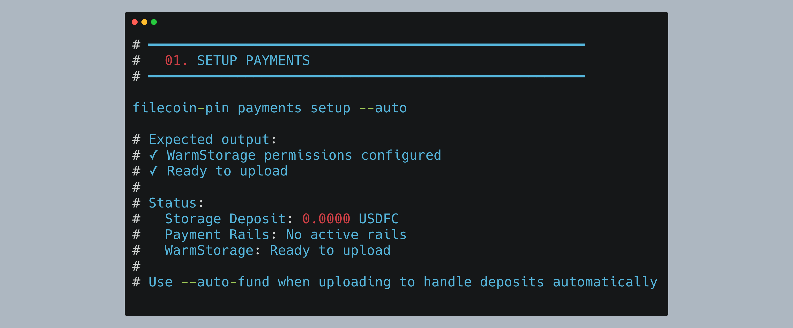
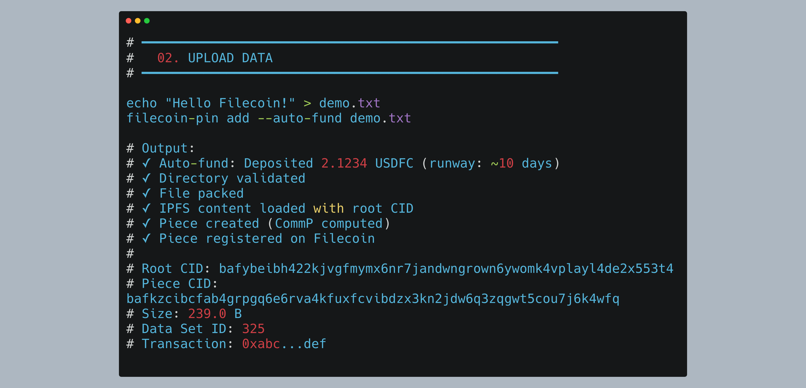
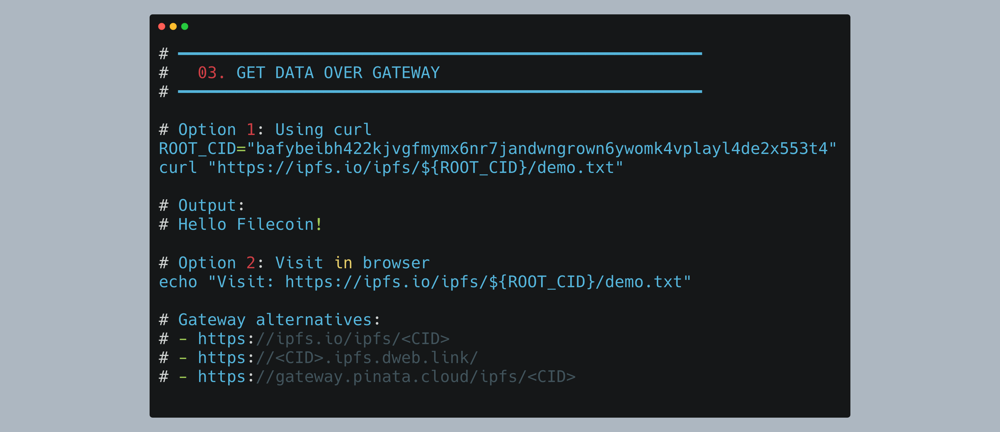

# Filecoin Pin CLI + GitHub Actions Walkthrough
> Update: 10.13.2025 4:00 PM PDT

**How to use the Filecoin Pin CLI and creating GitHub Actions from the terminal**

## Get Started Now

### 1. Setup Payments

Configure permissions for automatic payment handling:



### 2. Upload Data

Upload your file with automatic funding:



### 3. Retrieve over an IPFS Gateway

Retrieve your data using the IPFS gateway:



### 4. Prove Storage
Verify your data is stored with cryptographic proofs:

```bash
filecoin-pin data-set 325
```

**Key proof indicators:**
- **Status: live** - Active with ongoing PDP proofs
- **PDP rail ID: 631** - Active payment rail for storage proofs
- **Min proving period: 30 epochs** - Proofs submitted every 15 minutes
- **CommP** - Cryptographic piece commitments (Filecoin piece CIDs)
- **Leaf count: 21** - Merkle tree leaves used in proof verification

See Step 4 below for full output.

---

> NOTE! For demo purposes, I have created a THROWAWAY PRIVATE KEY.  **NEVER USE YOUR PRIVATE KEY IN A REPOSITORY OR EXPOSE IT**.
> The repo references using your private key LOCALLY as an ENV VARIABLE.
> When you create a GITHUB ACTION, use GITHUB SECRETS to store your private key.

## Who is this for
1. Existing IPFS developers who want to use Filecoin to persist their data
2. Technical users who want to use GitHub Actions to automate deployment of IPFS Files onto decentralized storage
3. Agent builders that want to store their agent cards and validation materials on Filecoin for cryptographic proof of storage

---

## Prerequisites

### Install Required Tools

```bash
# Install Node.js 22+ (required for filecoin-pin)
nvm install 22
nvm use 22

# Install filecoin-pin globally
npm install -g filecoin-pin

# Install ipfs-car (for CAR file operations)
npm install -g @ipld/car-cli

# Install GitHub CLI
brew install gh  # macOS
# or
sudo apt install gh  # Ubuntu/Debian

# Install Foundry (for wallet operations)
curl -L https://foundry.paradigm.xyz | bash
# Then run this in a new terminal:
foundryup
```

### Verify Installation

```bash
filecoin-pin --version
# Expected: filecoin-pin v0.6.0 (or later)

gh --version
# Expected: gh version 2.40.0 (or later)

node --version
# Expected: v22.x.x or higher

cast --version
# Expected: cast 0.2.0 (or later)
```

---

## Part 0: Wallet Setup from Scratch

> **Note**: The `filecoin-pin` CLI expects a `PRIVATE_KEY` environment variable. This section shows initial setup.

### Step 0.1: Generate a New Wallet

Generate wallet using Foundry:
```bash
cast wallet new
```

Save the private key and wallet address.

### Step 0.2: Get Testnet FIL

Get 100 tFIL from ChainSafe faucet (requires browser):
```bash
open "https://faucet.calibnet.chainsafe-fil.io/funds.html"
```

### Step 0.3: Get USDFC Stablecoin

1. Visit [USDFC minting app](https://stg.usdfc.net)
2. Import your private key to MetaMask
3. Add Filecoin Calibration network (Chain ID: 314159)
4. Mint 200 USDFC using 98 FIL collateral

Final state: ~2 tFIL (gas) + 200 USDFC (storage payments)

---

### Step 0.4: Create Environment File

> I put my private key on this repo for DEMO purposes.  It is a TESTNET KEY.  **NEVER USE YOUR PRIVATE KEY IN A REPOSITORY OR EXPOSE IT**.

Save your credentials **locally** for easy reuse:

```bash
cat > ~/.filecoin-pin-env << 'EOF'
export PRIVATE_KEY="0x8eef...c414"
export WALLET_ADDRESS="0x5a0c7D45C3834E4eB18c26C60932B757A43B7B0B"
export RPC_URL="https://api.calibration.node.glif.io/rpc/v1"
EOF

# Load variables
source ~/.filecoin-pin-env

# Verify
echo "Wallet: $WALLET_ADDRESS"
echo "Private Key: ${PRIVATE_KEY:0:10}..."
echo "RPC URL: $RPC_URL"
```

---

## Part 1: Filecoin Pin CLI Commands

All commands in this section use the environment variables set in Part 0 (Step 0.4). If you're starting a new terminal session, reload them:

```bash
source ~/.filecoin-pin-env
```

> **Note:** These commands work directly without running a server/daemon. The `PRIVATE_KEY` and `RPC_URL` environment variables must be set.

---

### Step 1: Setup Payments

Configure payment approvals (permissions only - deposits handled automatically with `--auto-fund`):

```bash
filecoin-pin payments setup --auto
```

> **What `--auto` does**: Configures WarmStorage contract permissions automatically. No deposit required at this step - use `--auto-fund` when uploading to handle deposits automatically.


---

### Step 2: Upload Data

Use `--auto-fund` flag to automatically handle payment deposits (v0.7.0+).

**Upload a file:**

```bash
# Create test file
echo "Hello Filecoin from CLI!" > demo.txt

# Upload to Filecoin
filecoin-pin add --auto-fund demo.txt
```


**Key values explained:**
- **Root CID**: `bafybeibh422kjvgfmymx6nr7jandwngrown6ywomk4vplayl4de2x553t4` - IPFS content identifier for your data
- **Piece CID**: `bafkzcibcfab4grpgq6e6rva4kfuxfcvibdzx3kn2jdw6q3zqgwt5cou7j6k4wfq` - Filecoin piece commitment (cryptographic proof)
- **Piece ID**: `0` - Reference within the data set
- **Data Set ID**: `325` - On-chain data set containing your upload
- **Transaction**: `0xc85e49d2ed745cc8c5d7115e7c45a1243ec25da7e73e224a744887783afea42b` - Blockchain confirmation hash
- **Direct Download URL**: Direct link to retrieve your data from the storage provider

✅ **Your file is now stored on Filecoin with ongoing proof of possession!**

---

**Upload a directory:**

```bash
# Create test directory
mkdir my-data
echo "File 1" > my-data/file1.txt
echo "File 2" > my-data/file2.txt
echo "File 3" > my-data/file3.txt

# Upload entire directory with auto-funding
filecoin-pin add --auto-fund my-data/
```

**Expected Output:**
```
Filecoin Pin Add

✓ Directory validated

✓ Connected to calibration

✓ Payment capacity verified

✓ Directory packed with root CID: bafybeig27btater5fpt3l67gbme3sebqk3ynwdhlbrbuk3q7espiyplan4

✓ IPFS content loaded (433.0 B)

✓ Payment capacity verified

✓ Storage context ready

━━━ Add Complete ━━━

Network: calibration

Add Details
  File: my-data/
  Size: 433.0 B
  Root CID: bafybeig27btater5fpt3l67gbme3sebqk3ynwdhlbrbuk3q7espiyplan4

Filecoin Storage
  Piece CID: bafkzcibcjmcnyio2ocxhmtq34uh5ct425xzpnor532zku7tjvqf5toodbxtsqhi
  Piece ID: 1
  Data Set ID: 325

Storage Provider
  Provider ID: 3
  Name: ezpdpz-calib
  Direct Download URL: https://calib.ezpdpz.net/piece/bafkzcibcjmcnyio2ocxhmtq34uh5ct425xzpnor532zku7tjvqf5toodbxtsqhi

Transaction
  Hash: 0xc9fb1cc29632c9fa156cd15a179548e6bafc4fec20c1ba52b8656e8b7db04a39
Add completed successfully
```

**Key details:**
- **Root CID**: `bafybeig27btater5fpt3l67gbme3sebqk3ynwdhlbrbuk3q7espiyplan4` - IPFS directory structure
- **Size**: 433.0 B - Includes all files plus directory metadata
- **Piece ID**: `1` - Second piece in the same Data Set ID 325
- **Data Set ID**: `325` - Same data set as the single file upload (multiple pieces grouped together)

> 💡 **Note**: Multiple uploads to the same payment configuration are grouped into the same Data Set, with each upload assigned a unique Piece ID.

---

### Step 3: Retrieve over IPFS Gateway

Retrieve your uploaded data using any IPFS gateway:

```bash
# Using curl
ROOT_CID="bafybeibh422kjvgfmymx6nr7jandwngrown6ywomk4vplayl4de2x553t4"
curl "https://ipfs.io/ipfs/${ROOT_CID}/demo.txt"
```

**Output:**
```
Hello Filecoin from CLI!
```

**Other gateway options:**
- `https://ipfs.io/ipfs/<CID>`
- `https://<CID>.ipfs.dweb.link/`
- `https://gateway.pinata.cloud/ipfs/<CID>`

---

### Step 4: Prove Storage

Get detailed information about a specific data set (this queries the blockchain directly) that includes proofs:

```bash
filecoin-pin data-set 325
```

**Expected Output:**
```
Filecoin Onchain Cloud Data Sets

━━━ Data Sets ━━━

Data Set #325 • live
  Managed by Warm Storage: yes
  CDN add-on: disabled
  Pieces stored: 2
  Leaf count: 21
  Total size: 672.0 B
  Client data set ID: 0
  PDP rail ID: 631
  CDN rail ID: none
  Cache-miss rail ID: none
  Payer: 0x5a0c7D45C3834E4eB18c26C60932B757A43B7B0B
  Payee: 0xa3971A7234a3379A1813d9867B531e7EeB20ae07
  Service provider: 0xa3971A7234a3379A1813d9867B531e7EeB20ae07
  Provider: ezpdpz-calib (ID 3)
  Commission: 0.00%

Provider Service
  Service URL: https://calib.ezpdpz.net
  Min piece size: 1.0 KB
  Max piece size: 32.0 GB
  Storage price: < 0.0001 USDFC/TiB/month
  Min proving period: 30 epochs
  Location: unknown
  Payment token: USDFC (native)

Metadata
    source: filecoin-pin
    withIPFSIndexing: (empty)

Pieces
  Total pieces: 2
  Unique CommPs: 2
  Unique root CIDs: 2

  #0
    CommP: bafkzcibcfab4grpgq6e6rva4kfuxfcvibdzx3kn2jdw6q3zqgwt5cou7j6k4wfq
    Root CID: bafybeibh422kjvgfmymx6nr7jandwngrown6ywomk4vplayl4de2x553t4
  #1
    CommP: bafkzcibcjmcnyio2ocxhmtq34uh5ct425xzpnor532zku7tjvqf5toodbxtsqhi
    Root CID: bafybeig27btater5fpt3l67gbme3sebqk3ynwdhlbrbuk3q7espiyplan4
Data set inspection complete
```

**Cryptographic Proof Information:**

This command queries the blockchain to show proof that your data is stored:

**🔐 Proof Elements:**
- **Status: live** - Data set is active with ongoing PDP (Proof of Data Possession) proofs
- **PDP rail ID: 631** - Active payment rail funding continuous proof verification
- **Min proving period: 30 epochs** - Provider submits proofs every 15 minutes
- **Leaf count: 21** - Merkle tree leaves used in cryptographic verification
- **CommP (Piece Commitments)** - Cryptographic commitments proving data integrity:
  - Piece #0: `bafkzcibcfab4grpgq6e6rva4kfuxfcvibdzx3kn2jdw6q3zqgwt5cou7j6k4wfq`
  - Piece #1: `bafkzcibcjmcnyio2ocxhmtq34uh5ct425xzpnor532zku7tjvqf5toodbxtsqhi`

**📦 Stored Data:**
- **Pieces stored: 2** - demo.txt (#0) and my-data/ directory (#1)
- **Total size: 672.0 B** - Combined size of both pieces
- **Root CIDs** - IPFS content identifiers for retrieval

**💰 Payment & Provider:**
- **Service URL**: https://calib.ezpdpz.net - Direct access to download pieces
- **Storage price**: < 0.0001 USDFC/TiB/month
- **Provider**: ezpdpz-calib (ID 3)

> 💡 **Note**: This command queries the smart contracts on-chain to retrieve all data set information. The data shown is live blockchain state, not cached data.


## Quick Reference

### filecoin-pin Commands

```bash
# Payment Management
filecoin-pin payments status              # Check status
filecoin-pin payments setup --auto        # Setup permissions (first time)
filecoin-pin payments fund --days 30      # Adjust to exact 30-day runway
filecoin-pin payments fund --amount 100   # Set exact 100 USDFC deposit

# Upload to Filecoin
filecoin-pin add <file>                   # Upload file
filecoin-pin add --auto-fund <file>       # Upload with auto-funding (v0.7.0+)
filecoin-pin add <directory>              # Upload directory
filecoin-pin add --bare <file>            # Upload without wrapper

# Data Set Management
filecoin-pin data-set --ls                # List all
filecoin-pin data-set <id>                # Inspect specific
filecoin-pin data-set --ls might be changing to `filecoin-pin data list` # https://github.com/filecoin-project/filecoin-pin/issues/66
```

### GitHub CLI Commands

```bash
# Workflow Management
gh workflow list                          # List workflows
gh workflow run <workflow>                # Trigger workflow
gh workflow run <workflow> -f key=value   # With inputs

# Run Management
gh run list                               # List runs
gh run watch <run-id>                     # Watch run
gh run view <run-id>                      # View details
gh run view <run-id> --log                # View logs
gh run view <run-id> --web                # Open in browser
gh run download <run-id>                  # Download artifacts

# Secret Management
gh secret list                            # List secrets
gh secret set <name>                      # Set secret
```

### Manual Checks

```bash
# Check wallet balance and payment status
filecoin-pin payments status

# Check transaction
cast receipt <tx-hash> --rpc-url <rpc-url>

# View on explorer
open "https://calibration.filfox.info/address/<address>"
open "https://calibration.filfox.info/tx/<tx-hash>"
```

---

## Summary

### What We Covered

- **filecoin-pin CLI** - Direct commands without server
- **Manual payment checks** - Verify wallet state and deposits
- **GitHub Actions** - Created entirely from CLI
- **Workflow testing** - Using `gh` CLI for management
- **Artifact retrieval** - Download results from terminal

---


